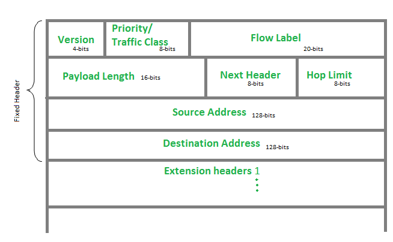

# Racunarske mreze

### *Ethernet standardi*  
*Maksimalna duzina segmenta == Distanca*  

Tip kabla | Bandwidth [Mbps] | UTP Kategorija | Distanca [m] | Duplex | Konektor | Interfejs switch-a | Tip kodovanja | # parica | # parica za primanje 
--- | --- | --- | --- | --- | --- | --- | --- | --- | ---
10Base-5 | 10 | Thicknet Coaxial | 500 | Half | N-Con | FastEthernet | ? | ? | ?
10Base-2 | 10 | Thinnet Coaxial | 185 | Half | BNC | FastEthernet | ? | ? | ? 
10Base-T | 10 | Cat3/Cat5 | 100 | Half | RJ45 | FastEthernet | Manchester | 2 | 2
100Base-TX | 100 | Cat5 | 100 | Half | RJ45 | FastEthernet | 4b5b | 2 | 2 
100Base-TX | 200 | Cat5 | 100 | **Full** | RJ45 | FastEthernet | 4b5b | 2 | 2  
100Base-FX | 100 | Multimode Fiber | 400 | Half | ST/SC | FastEthernet | 4b5b | 2 | 1
100Base-FX | 200 | Multimode Fiber | 2000 | **Full** | ST/SC | FastEthernet | 4b5b | 2 | 1
1000Base-T | 1000 | Cat5e | 100 | Full | RJ45 | GigabitEthernet | 8b10b | 4 | 4
1000Base-TX | 1000 | Cat6 | 100 | Full | RJ45 | GigabitEthernet | 8b10b | 4 | 4
1000Base-SX | 1000 | Multimode Fiber | 550 | Full | SC/LC | GigabitEthernet | 8b10b | 4 | 4
1000Base-LX | 1000 | Singlemode Fiber | 2000 | Full | SC/LC | GigabitEthernet | 8b10b | 4 | 4
10GBase-CX4 | 10000 | Twin-axial | 100 | Full | InfiniBand | 10GbE | 64b66b | 0 | 0
10GBase-T | 10000 | Cat6a/Cat7 | 100 | Full | RJ45 | 10GbE | 64b66b | 4 | 4 
10GBase-LX4 | 10000 | Multimode Fiber | 300 | Full | LC/SC | 10GbE | 64b66b | 0 | 0
10Gbase-LX4 | 10000 | Singlemode Fiber | 10000 | Full | LC/SC | 10GbE | 64b66b | 0 | 0

___

### *Ethernet frame polja*  
*Skoro nikad ne daje preambulu, SoFD i FCS*  
**FCS se UVIJEK uracunava/dodaje kod racunanja kolicina korisnih/kontrolnih informacija frejma**  


Polje | Znacenje
--- | ---
Preamble | nesto za sinhronizaciju nekog PHY neceg
Start of Frame Delimiter | isto ^
Destination address (MAC) | MAC adresa odredista
Source address (MAC) | MAC adresa posiljaoca
Type/Length | oznacava tip paketa (> 0x0600), ili duzinu CIJELOG frejma (<= 0x0600)
Data | paket sa mreznog sloja
Frame Check Sequence | sluzi za error-detection

Type/Length vrijednost | Protokol
--- | ---
0x0800 | IPv4
0x0806 | ARP
0x86dd | IPv6
___

### *IPv4 Header polja*


Polje | Znacenje
--- | ---
Version | uvijek 4 za IPv4
IHL (IP Header Length) | pomnozeno sa 4 -> duzina headera (bez data)
Policy | nista
Total Length | ukupna duzina IPv4 paketa
Identification | nesto oko fragmentacije paketa
Flags | 3 bita, kontrolisanje fragmentacije: 0b100 - More Fragments, 0b010 - Dont Fragment
Fragment offset | predstavlja offset fragmenta u odnosu na pocetni nefragmentovani paket
TTL (Time to Live) | preostali broj hopova paketa do odbacivanja
Protocol | oznacava protokol koji se koristi u IP datagramu (bitniji navedeni)
Header Checksum | error-checking
Source address | ipv4 adresa posiljaoca
Destination address | ipv4 adresa odredista
Options (neobavezno) | neobavezno, ali zna ubaciti -> prepoznaje se preko IHL
Padding | da se zaokruzi velicina headera na vrijednost djeljivu sa 4 (zbog IHL)
*Data, max. 65515B* | sadrzi neki podataka sa aplikacionog sloja (TCP/IP)

Protocol vrijednost | Protokol
--- | ---
0x01 | ICMP
0x06 | TCP
0x11 | UDP
0x29 | IPv6 Tunneling

___

### IPv6 Header polja  


Polje | Znacenje
--- | ---
Version | uvijek =6 (0b0110) za IPv6
Traffic Class | odredjuje prioritet paketa (congestion controlled, uncontrolled)
Flow Label | nmg razumt
Payload Length | velicina korisnih podataka 
Next Header | odredjuje tip headera u data polju (npr. tcp, udp)
Hop Limit | isto kao i TTL
Source Address | 128-bitna (16-bajtna) IPv6 adresa posiljaoca
Destination Address | 128-bitna (16-bajtna) IPv6 adresa posiljaoca
___

### TCP i UDP 

  

*TCP - Transmission Control Protocol*  
*UDP - User Datagram Protocol*  

Polje | Znacenje
--- | ---
Source port | Izvorni port
Destination port | Odredisni port
Sequence number | Pozicija prvog bajta koji se salje u sledecem segmentu, inicijalno dobija nasumicnu vrijednost
Acknowledgement number | Kolicina primljenih podataka
Header Length | Duzina headera (mnozi se sa 4)
Reserved | ---
Code bits | Flegovi 
Window | Oznacava koliko bajtova primalac moze prihvatiti u jednom segmentu
Checksum | Error-checking
Urgent | Ukoliko je postavljen URG fleg, oznacava gdje hitni podaci zavrsavaju, relativno od pocetka DATA sekcije
Options | (0 -:- 32 bits)
  
*Flegovi*  
`[URG] | [ACK] | [PSH] | [RST] | [SYN] | [FIN]`, npr. `011000 -> {ACK, PSH} = 1, {URG, RST, SYN, FIN} = 0` 
Flag | Svrha
--- | ---
URG | Segment visokog prioriteta, oznacava ga za obradu (pri pristizanju cijelog paketa) 
ACK | Pri odgovoru, obavjestava posiljaoca o uspjesnom prijemu paketa
PSH | "Guranje paketa", oznacavanje paketa za obradu umjesto buffer-ovanja
RST | Resetovanje konekcije i oslobadjanje resursa
SYN | Koristi se *samo* u prvom koraku 3-way handshake-a (*uspostavljanje TCP veze*)
FIN | Slanje zahtjeva za zavrsavanje komunikacije kada nema vise podataka

*TCP Three-way handhake*  
  
- Kolicina korisnih podataka u prvom frejmu/paketu/segmentu *je uvijek NULA*
- Dakle, procentualna kolicina kontrolnih podataka je 100%, a korisnih 0%

### ICMP (Internet Control Message Protocol)


Polje | Znacenje
--- | ---
Type | Tip poruke
Code | Pod-tip poruke
Checksum | Error-checking

*Vrijednosti ICMP Type polja (ima ih brukica ovo su samo neki)*
Vrijednost | Podtipovi |Znacenje
--- | --- | ---
0 | 0 | Echo Reply
8 | 0 | Echo Request
11 | 0 | Time Exceeded (ttl=0 ili predugacak fragment reassembly)
30 | 0 | Traceroute (information request)

___

*Specificni portovi*  
*Server dobija nizi port, klijent visi*
Port # | Tip porta | Protokol | Abrevijacija
--- | --- | --- | ---
20, 21 | TCP | File Transfer Protocol | FTP 
22 | TCP/UDP | Secure Shell | SSH
23 | TCP | Teletype Network | Telnet
25 | TCP | Simple Mail Transfer Protocol | SMTP
53 | TCP/UDP | Domain Name System | DNS
67, 68 | UDP | Dynamic Host Configuration Protocol | DHCP
69 | UDP | Trivial File Transfer Protocol | TFTP
80 | TCP | Hypertext Transfer Protocol | HTTP
110 | TCP | Post Office Protocol | POP3
443 | TCP | Secure Hypertext Transfer Protocol | HTTPS

___

### *IPv4*  
*IPv4 Klase*
Klasa | Prvi biti | Svrha
--- | --- | ---
A | 0... | GAN
B | 10.. | WAN
C | 110. | LAN
D | 1110 | Multicast
E | 1111 | Experimental

*Blokovi privatnih adresa*
Pocetna adresa | Zadnja adresa | CIDR notacija
--- | --- | ---
10.0.0.0 | 10.255.255.255 | 10.0.0.0/8
172.16.0.0 | 172.31.255.255 | 172.16.0.0/12
192.168.0.0 | 192.168.255.255 | 192.168.0.0/16

*Specijalne adrese*  
Naziv | Vrijednost | Upotreba
--- | --- | ---
Network | prva adresa u mrezi | odredjivanje mreze
Broadcast | zadnja adresa u mrezi | broadcast komunikacija (svi uredjaji)
Default route | 0.0.0.0, rezervisan 0.0.0.0/8 | prosljedjivanje paketa sa nepoznatom odredisnom mrezom
Loopback | 127.0.0.1, rezervisan 127.0.0.0/8 | slanje samom sebi
Link-local | 169.254.0.0/16 | kad je DHCP nedostupan, ne mogu se koristiti na javnoj mrezi
Test-NET | 192.0.2.0/24 | ucenje i predavanje, mogu se koristiti na javnoj mrezi
Multicast | 224.0.0.0/4 | komunikacija sa multicast grupama
Experimental | 240.0.0.0/4 | naucne svrhe, ne mogu se koristiti za hostove

___


### Teze i ostalo
- sve multicast IPv6 adrese dijele prvih 8 bita (prvi bajt) -> 0xFF::/8
- vel. IPv6 headera = 40B (const.), vel. IPv4 headera: 20 -:- 60 bajtova (0b1111 * 4 = 60)
- ne postoji broadcast u IPv6 protokolu
- entry u MAC tabeli switch-a: `[MAC_adresa, izlazni_interfejs]`
- Manchester kodovanje: `0 -> 01, 1 -> 10`, zadrzava se interval (dijeli se na dva dijela)
- 4B5B kodovanje: treba nauciti cijelu tabelu, ovo moze lako lagano dati jer mu se moze
- (laicki) svaki port switch-a == kolizioni domen, svaki port router-a == broadcast domen
- [!] kolizioni domeni se ne mogu preklapati, a hub ne ogranicava/razgranicava ove domene
- MAC tabela switch-a, ukoliko je na neki interfejs prikacen hub, moze imati vise razlicitih MAC adresa za isti interfejs
- ne mozemo pingovati privatne adrese na udaljenoj mrezi, ukoliko njen ruter nema pravilno konfigurisan NAT
- kod komunikacije izmedju hosta i web-servisa, na portovima 80/443, uspostavlja se *SAMO JEDNA* TCP veza
- DHCP server (ukoliko ne pruza i DNS servis) ne moze da uspostavi TCP konekciju sa nekim TCP-baziranim servisom (npr. HTTP/S)
- DNS Resolver nece biti aktiviran ukoliko se ne referencira simbolicko ime
- Malo chatgpt:
```
Ruteri odbacuju IP pakete čija vrednost polja Time-to-Live (TTL) dostigne 0. Vrednost TTL se umanjuje svaki put kada paket prolazi kroz ruter. Ovo je deo osnovnog mehanizma za sprečavanje beskonačnih petlji u mrežama.
Postupak je sledeći:

- Kada izvor kreira IP paket, polje TTL se postavlja na određenu vrednost (najčešće se postavlja na neki inicijalni broj, na primer, 64).
- Kada ruter prima paket, on umanjuje vrednost polja TTL za 1.
- Ako vrednost postane 0, ruter odbacuje paket i šalje ICMP poruku "Time Exceeded" izvoru kako bi ga obavestio da je paket odbačen zbog isteka vremena.
- Ako vrednost TTL nije 0, ruter prosleđuje paket na sledeći čvor u mreži.
```
___
